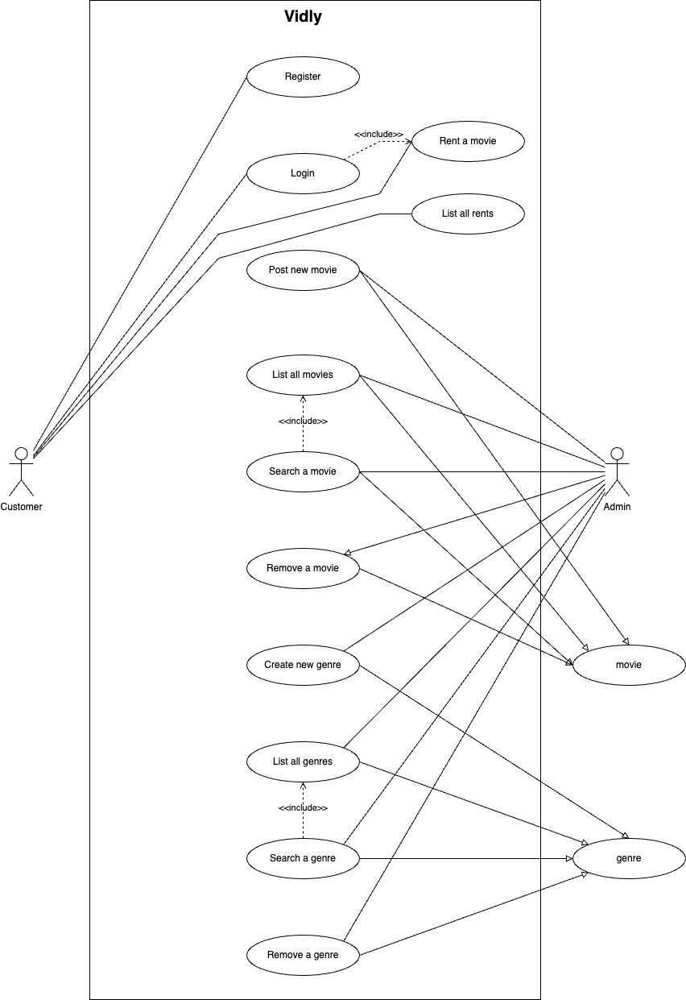
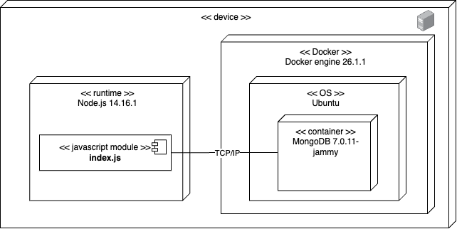
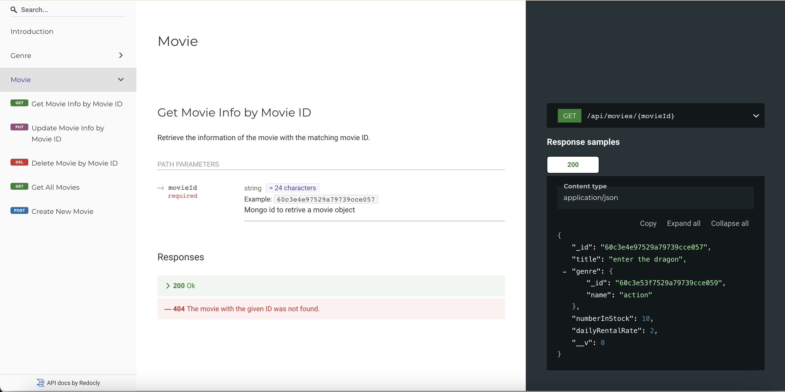

<p align="center"></p>

# Vidly API

- [Project description](#project-description)
  - [Architecture](#architecture)
  - [Features](#features)
- [Requirements](#requirements)
- [User guide](#user-guide)
  - [Endpoints](#endpoints)
  - [MongoDB document schemas](#mongoDB-document-schemas)
- [Install guide](#install-guide)
  - [Run tests](#run-tests)
- [Comments](#comments)
- [License](#license)
- [Author](#author)

## Project description

Vidly is a backend from a rental movie app using Node.js.

### Architecture

#### Use cases



#### Deployment



### Features

For see full documentation, please visit when development mode is running [Vidly API docs](http://localhost:3000/redoc.html). The documentation was created using [Redoc](https://redocly.com/), so you should see this webpage.



## Requirements

- Node.js version: 14.16.1
- Npm version: 6.14.12

## User guide

### Endpoints

This API is composed for the following services:

#### Authentication

- `POST /api/auth`

#### User

- `GET /api/users/me`
- `POST /api/users`

#### Customer

- `GET /api/customers`
- `GET /api/customers/:id`
- `POST /api/customers`
- `PUT /api/customers/:id`
- `DELETE /api/customers/:id`

#### Genre

- `GET /api/genres`
- `GET /api/genres/:id`
- `POST /api/genres`
- `PUT /api/genres/:id`
- `DELETE /api/genres/:id`

#### Movie

- `GET /api/movies`
- `GET /api/movies/:id`
- `POST /api/movies`
- `PUT /api/movies/:id`
- `DELETE /api/movies/:id`

#### Rental

- `GET /api/rentals`
- `POST /api/rentals`

### MongoDB document schemas

#### User Schema

This object is a representation for user:

```json
{
  "_id": "65a02b00d4c97df504ad5edc",
  "name": "john doe",
  "email": "johndoe@mailinator.com",
  "hashedPassword": "$2b$10$FRrxHESMToFtDj7USDR5Ke8Oletm7byHW5QcYDsHZBofeM44rIJpy",
  "isAdmin": false,
  "__v": 0
}
```

#### Customer Schema

This object is a representation for customer:

```json
{
  "_id": "65a02b00d4c97df504ad5edc",
  "name": "Kevin Mitnik",
  "isGold": true,
  "phone": "98765432",
  "__v": 0
}
```

#### Genre Schema

This object is a representation for genre:

```json
{
  "_id": "65a02b00d4c97df504ad5edc",
  "name": "Kevin Mitnik",
  "__v": 0
}
```

#### Movie Schema

This object is a representation for movie:

```json
{
  "_id": "65a02b00d4c97df504ad5edc",
  "title": "Movie",
  "genre": "Action",
  "numberInStock": 10,
  "dailyRentalRate": 2.5,
  "__v": 0
}
```

#### Rental Schema

This object is a representation for rental:

```json
{
  "_id": "65a02b00d4c97df504ad5edc",
  "customer": {
    "name": "Kevin Mitnik",
    "isGold": true,
    "phone": "98765432"
  },
  "movie": {
    "title": "Movie",
    "dailyRentalRate": 2.5
  },
  "dateOut": "2024-1-10",
  "dateReturned": "2024-1-18",
  "rentalFee": 8.95,
  "__v": 0
}
```

## Install guide

Below are the instructions to install and run the project in development mode.

```bash
git clone https://github.com/christophermontero/vidly-api.git
cd vidly-api
```

Make sure you have MongoDB running before start the project in development mode. Note that the project uses default environment variables for this mode, you can set different values in default.json file.

```bash
npm start:dev
```

or use this command for run in production. Further, you can find the environment variables names in custom-environment-variables.json file.

```bash
npm start
```

### Run tests

For run unit tests use the following command.

```bash
npm test
```

## Comments

If you have any feedback, please reach out at cgortizm21@gmail.com

## License

This project is under [MIT License](https://opensource.org/license/mit).

## Author

- [@christophermontero](https://github.com/christophermontero)
